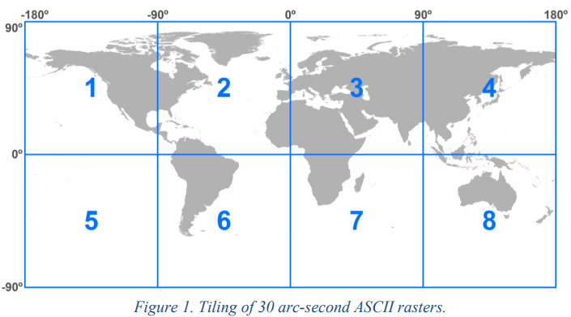
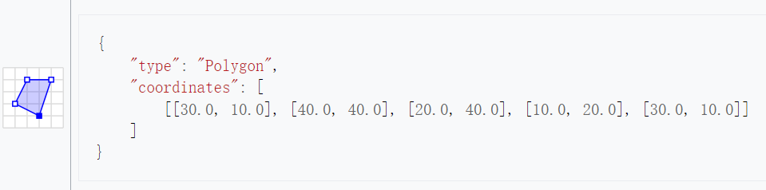
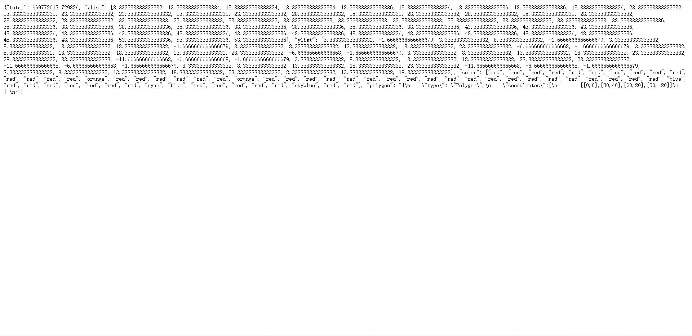
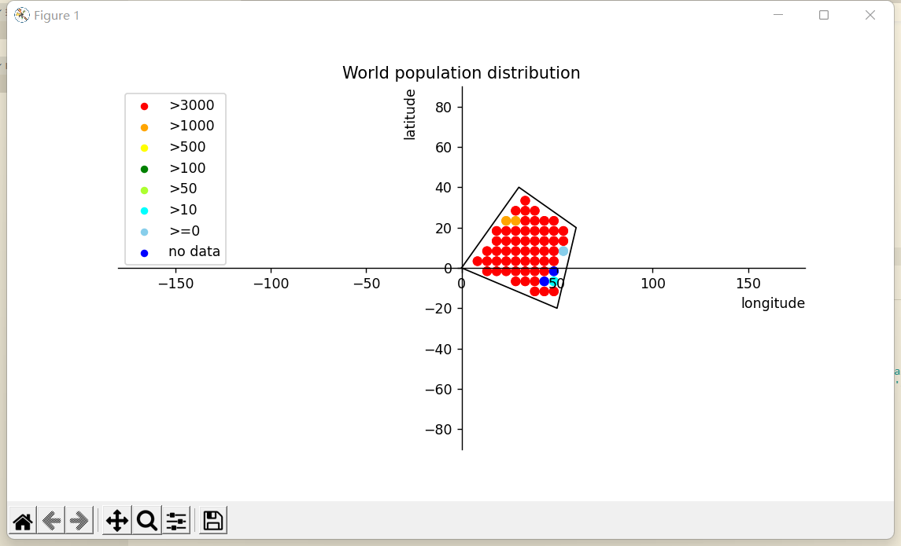
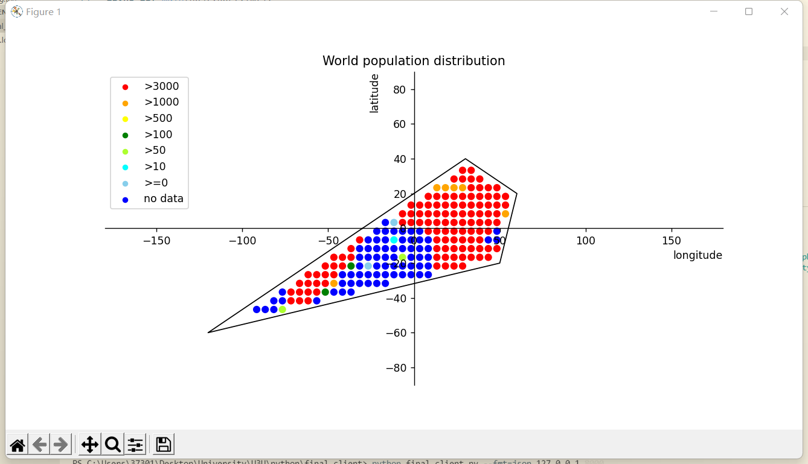
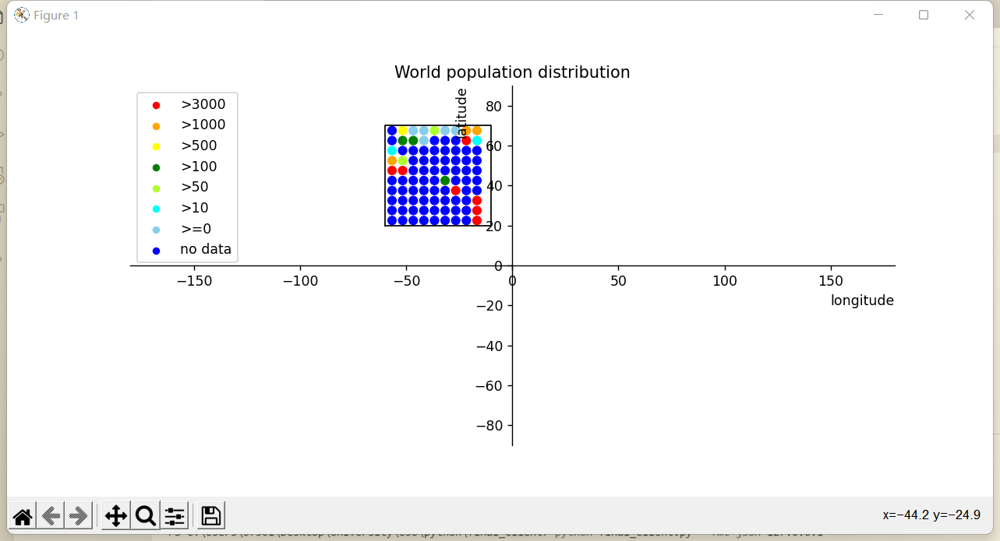
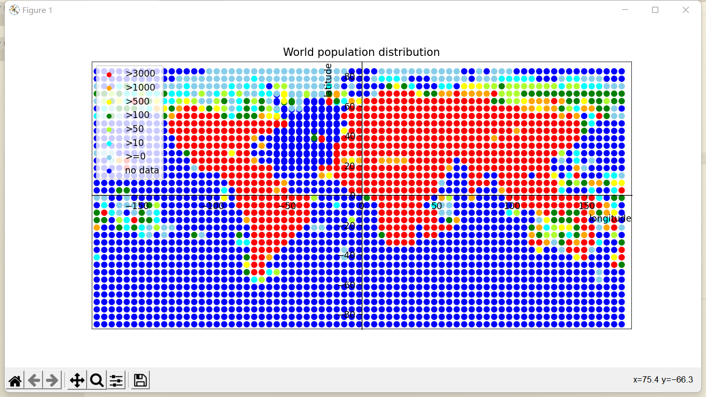

# **1 Python程序设计-大作业**

班级：2019211309

学号：2019211567

姓名：范子豪

## **1.1 作业题目**

### **1.1.1 数据**
gpw-v4-population-count-rev11_2020_30_sec_asc.zip是一个全球人口分布数据压缩文件，解压后包括了8个主要的asc后缀文件，他们是全球网格化的人口分布数据文件，这些文件分别是：
· gpw-v4-population-count-rev11_2020_30_sec_1.asc
· gpw-v4-population-count-rev11_2020_30_sec_2.asc
· gpw-v4-population-count-rev11_2020_30_sec_3.asc
· gpw-v4-population-count-rev11_2020_30_sec_4.asc
· gpw-v4-population-count-rev11_2020_30_sec_5.asc
· gpw-v4-population-count-rev11_2020_30_sec_6.asc
· gpw-v4-population-count-rev11_2020_30_sec_7.asc
· gpw-v4-population-count-rev11_2020_30_sec_8.asc
这些文件分布对应地球不同经纬度的范围。

### **1.1.2 服务端**
压缩文件（gpw-v4-population-count-rev11_2020_30_sec_asc.zip）是一个全球人口分布数据。基于Sanic实现一个查询服务，服务包括：
· 按给定的经纬度范围查询人口总数，查询结果采用JSON格式。
· 不可以采用数据库，只允许使用文件方式存储数据。
· 可以对现有数据进行整理以便加快查询速度，尽量提高查询速度。
查询参数格式 采用GeoJSON（https://geojson.org/）的多边形（每次只需要查询一个多边形范围，只需要支持凸多边形）

### **1.1.3 客户端**
针对上面的查询服务，实现一个服务查询客户端，数据获取后使用Matplotlib散点图（Scatter）进行绘制。
· 横坐标（x轴）为经度。
· 纵坐标（y轴）为维度。
## **1.2 服务端代码**
程序源代码嵌入下方的code block中。
1. 数据预处理
```python
    myList = [[0 for k in range(10810)]for i in range(10810)]
    myListNew = [[0 for k in range(110)]for i in range(110)]
    line = list()
    def calSecLayer(lines,cols):
        tempIndex = 0
        flag = 0
        for i in range((lines-1)*100,lines*100):
            for j in range((cols-1)*100,cols*100):
                if float(myList[i][j]) != -9999:
                    tempIndex += float(myList[i][j])
                    flag = 1
        if flag == 1:
            myListNew[lines-1][cols-1] = tempIndex
        else: myListNew[lines-1][cols-1] = -9999
    def chooseFile(fileNum):
        fileStr = 'gpw_v4_population_count_rev11_2020_30_sec_'
        with open(fileStr+str(fileNum)+'.asc','r') as originFile:
            line = originFile.readlines()
        for i in range(6,10806):
            myList[i-6] = line[i].split(' ')
            if myList[i-6][len(myList[i-6])-1] == '\n':
                myList[i-6].pop()

    fileNum = 1
    while fileNum < 9:
        fileName = str(fileNum) + '.txt'
        with open (fileName,'w') as file:
            chooseFile(fileNum)
            print(fileNum)
            for i in range(108):
                for j in range(108):
                    calSecLayer(i+1,j+1)
                    file.write(str(myListNew[i][j])+' ')
                file.write('\n')
            fileNum = fileNum + 1
    with open ('final.txt','w') as file:
        with open ('1.txt','r') as file1:
            with open('2.txt','r') as file2:
                with open('3.txt','r') as file3:
                    with open('4.txt','r') as file4:
                        with open('5.txt','r') as file5:
                            with open('6.txt','r') as file6:
                                with open('7.txt','r') as file7:
                                    with open('8.txt','r') as file8:
                                        tempIndex = 0
                                        while tempIndex < 108:
                                            line1 = file1.readline()
                                            line1 = line1[:-1]
                                            line2 = file2.readline()
                                            line2 = line2[:-1]
                                            line3 = file3.readline()
                                            line3 = line3[:-1]
                                            line4 = file4.readline()
                                            line4 = line4[:-1]
                                            file.write(line1+line2+line3+line4+'\n')
                                            tempIndex = tempIndex + 1
                                        while tempIndex < 216:
                                            line1 = file5.readline()
                                            line1 = line1[:-1]
                                            line2 = file6.readline()
                                            line2 = line2[:-1]
                                            line3 = file7.readline()
                                            line3 = line3[:-1]
                                            line4 = file8.readline()
                                            line4 = line4[:-1]
                                            file.write(line1+line2+line3+line4+'\n')
                                            tempIndex = tempIndex + 1
```
2. 数据查询
```python
    from types import CellType
    from sanic import Sanic
    from sanic import response
    from sanic.response import json
    from shapely import geometry
    from shapely.geometry import Polygon
    import numpy as np
    import matplotlib.pyplot as plt
    import json

    app = Sanic(__name__)

    xlist = list()
    ylist = list()
    colorList = list()

    def calcPopulation(lonLats):
        lonMin = 999
        latMin = 999
        lonMax = -999
        latMax = -999
        polygon = geometry.Polygon(lonLats)
        # for point in lonLats:
        #     if point[0] > lonMax:
        #         lonMax = point[0]
        #     if point[0] < lonMin:
        #         lonMin = point[0]
        #     if point[1] > latMax:
        #         latMax = point[1]
        #     if point[1] <latMin:
        #         latMin = point[1]
        lonMin,latMin,lonMax,latMax = polygon.bounds
        step = 5/6
        lonMin = lonMin - lonMin%step + step
        lonMax = lonMax - lonMax%step
        latMin = latMin - latMin%step + step
        latMax = latMax - latMax%step
        step = 5
        populationTotal = 0
        for lon in np.arange(lonMin,lonMax,step):
            for lat in np.arange(latMin,latMax,step):
                PSW = (lon , lat)
                PSE = (lon + step , lat)
                PNW = (lon, lat + step)
                PNE = (lon + step,lat + step)
                lonLatsofSquare = [PSW,PSE,PNW,PNE]
                cellPolygon = geometry.Polygon(lonLatsofSquare)
                if polygon.contains(cellPolygon) == True:
                    population = getPopulationFromFile(lonLatsofSquare)
                    if float(population) != -9999:
                        populationTotal += float(population)*36
                    xlist.append((lon+lon+step)/2)
                    ylist.append((lat+lat+step)/2)
                    if float(population) > 3000:
                        colorList.append('red')
                    elif float(population) > 1000:
                        colorList.append('orange')
                    elif float(population) > 500:
                        colorList.append('yellow')
                    elif float(population) > 100:
                        colorList.append('green')
                    elif float(population) > 50:
                        colorList.append('greenyellow')
                    elif float(population) > 10:
                        colorList.append('cyan')
                    elif float(population) != -9999:
                        colorList.append('skyblue')
                    else:
                        colorList.append('blue')
        with open('Polygon.json','r') as file:
            line = file.read()
            dict = {'total' : populationTotal,'xlist':xlist,'ylist':ylist,'color':colorList,'polygon':line}
        global json_str 
        json_str = json.dumps(dict)
        
    @app.route('/json')
    async def handle_request(request):
        pointList = list()
        with open('polygon.json') as file:
            polygonJson = file.read()
            jsonDict = eval(polygonJson)
            for i in range(0,len(jsonDict['coordinates'][0])):
                pointList.append(jsonDict['coordinates'][0][i])     
        calcPopulation(pointList)
        with open('population.json','w') as f:
            f.write(json_str)
        return await response.file('population.json')

    def getPopulationFromFile(square):
        temp = 0
        step = 5/6
        cols = int( ( 180 + square[2][0] ) / step )
        lines = int( ( 90 - square[2][1] ) / step )
        with open('final.txt','r') as file:
            tempIndex = 0
            flag = 0
            line = file.readline()
            while tempIndex < lines + 6:
                line = file.readline()
                if tempIndex >= lines:
                    popList = line.split(' ')
                    for i in range(cols,cols + 6):
                        if float(popList[i]) != -9999:
                            temp += float(popList[i])       
                            flag = 1 
                tempIndex = tempIndex + 1
        if flag == 1:
            return temp/36
        else:
            return -9999

    if __name__ == '__main__':
        app.run(host="127.0.0.1", port=8000)
```
```json
    /*查询用到的geoJson，若要修改查询的多边形，只需修改coordinate即可，注意coordinate中的点按照多边形的顶点顺时钟排列*/
    {
        "type": "Polygon",
        "coordinates":[
            [[0,0],[30,40],[60,20],[50,-20]]
        ] 
    }
```
### 1.2.1 代码说明
1. 数据预处理
```
    数据预处理中，我的想法是由于8亿个数据实在太多，我首先对其分辨率进行压缩，每一万个grid合为一个新的grid，这样每一个文件中的10800*10800个数据就缩略为了108*108个数据，大大缩减了数据量。具体处理中，若一万个数据全为-9999，即这一万个grid里全都没有数据，则这一个大的grid也为-9999（no data），其余的不是全为-9999的grid则计算该10000个小grid的总人口（此时-9999的grid当作0）。
    将这压缩后的8个asc个文件按照世界地图的排列顺序存放在一个txt文件中，此时这个txt文件为432*216的，大大提高了搜索效率。此时一个grid对应的经度为360/432 = 0.8333 纬度为 180/216 = 0.8333，利于后续查询工作
```
2. 得到多边形坐标的边界bound

```python
    lonMin = lonMin - lonMin%step + step
    lonMax = lonMax - lonMax%step
    latMin = latMin - latMin%step + step
    latMax = latMax - latMax%step

    # 或直接调用库函数

    lonMin,latMin,lonMax,latMax = polygon.bounds
```
```
    我采取的策略是获取这个多边形的最小最大经度和纬度，以这个数据绘制一个矩形，将这个矩形作为一个筛选标准，将属于这个矩形的所有grid遍历，判断是否在多边形的bound中。关于多边形的bound，我采取的方式是利用geometry的库函数polygon.contains(cellPolygon)，运用此函数可以根据该多边形的各个顶点计算各条边的函数信息，通过函数边界来判断cellPolygon是否在指定范围中，大大简化了bound的计算
```

3. 根据bound遍历出包含的所有grid列表
```python
    for lon in np.arange(lonMin,lonMax,step):
                for lat in np.arange(latMin,latMax,step):
                    PSW = (lon , lat)
                    PSE = (lon + step , lat)
                    PNW = (lon, lat + step)
                    PNE = (lon + step,lat + step)
                    lonLatsofSquare = [PSW,PSE,PNW,PNE]
                    cellPolygon = geometry.Polygon(lonLatsofSquare)
                    if polygon.contains(cellPolygon) == True:
                        population = getPopulationFromFile(lonLatsofSquare)
                        populationTotal += float(population)
```
```
    按照上述`2.得到多边形坐标的边界bound`中对于该方法的描述：
    我采取的策略是获取这个多边形的最小最大经度和纬度，以这个数据绘制一个矩形，将这个矩形作为一个筛选标准，将属于这个矩形的所有grid遍历，判断是否在多边形的bound中。关于多边形的bound，我采取的方式是利用geometry的库函数polygon.contains(cellPolygon)，运用此函数可以根据该多边形的各个顶点计算各条边的函数信息，通过函数边界来判断cellPolygon是否在指定范围中
    若polygon.contains(cellPolygon)的结果为true，则说明该grid在bound中，则计算这个grid中的人口数，并将其加入总人口数。（no data视作0，总人口不变）
```
4. 根据grid列表获得多边形所含人口总数
```
    population = getPopulationFromFile(lonLatsofSquare)
    def getPopulationFromFile(square):
        temp = 0
        step = 5/6
        cols = int( ( 180 + square[2][0] ) / step )
        lines = int( ( 90 - square[2][1] ) / step )
        with open('final.txt','r') as file:
            tempIndex = 0
            flag = 0
            line = file.readline()
            while tempIndex < lines + 6:
                line = file.readline()
                if tempIndex >= lines:
                    popList = line.split(' ')
                    for i in range(cols,cols + 6):
                        if float(popList[i]) != -9999:
                            temp += float(popList[i])       
                            flag = 1 
                tempIndex = tempIndex + 1
        file.close()
        if flag == 1:
            return temp/36
        else:
            return -9999
```
```
    由于实际操作后，发现0.83经纬度作一个grid在实际绘图中，一个点的大小仍然过小，导致图格外不美观。故此时考虑每5经纬度设置一个散点，效果较好。故在根据grid列表获得多边形所含人口总数时，每5经纬度合成一个grid，故此时是每36个大grid合成一个散点。
    具体的获取策略为，通过传入散点的左上角坐标（经过处理，一定可以被0.8333）整除，得到在文件中的行数，根据该位置，读取该行至往下6行，以及通过经度获取列数，读取该列往右6列，将该36个大grid的总人口计算并返回，并根据该数据来绘制该处散点的颜色。
```

5. 处理grid与多边形相交的部分
```
    由于一个grid的初始大小为180/10800 = 0.0083333°，在经纬度上表现的很小，甚至不到0.01°，可见一个grid在一个polygon中有多渺小。而且我们输入的多边形的坐标很少有精确到小数点后3位的。
    以数学的方式说明的话，一个矩形若大小为10°*10°，此矩形里包含1452025个grid，边界上的的grid仅仅为4819个，占比仅为百分之0.3，故完全可以省略。
```

6. geoJson的运用
```
    我采用的方式是通过读取geojson中的coordinates来实现对该多边形的刻画，将其中的点存到一个pointList中，然后根据该pointList来构建polygon。故修改查询范围只需修改geojson中的cordinates即可。
```
```python
    with open('polygon.json') as file:
                polygonJson = file.read()
                jsonDict = eval(polygonJson)
                for i in range(0,len(jsonDict['coordinates'][0])):
                    pointList.append(jsonDict['coordinates'][0][i]) 
    polygon = geometry.Polygon(pointList)
```
7. sanic框架实现服务端客户端通信
```python
    # 构造json文件
    with open('Polygon.json','r') as file:
            line = file.read()
            dict = {'total' : populationTotal,'xlist':xlist,'ylist':ylist,'color':colorList,'polygon':line}
        global json_str 
        json_str = json.dumps(dict)
    # 将该json文件输出到指定网页上
    async def handle_request(request):
        pointList = list()
        with open('polygon.json') as file:
            polygonJson = file.read()
            jsonDict = eval(polygonJson)
            for i in range(0,len(jsonDict['coordinates'][0])):
                pointList.append(jsonDict['coordinates'][0][i])     
        calcPopulation(pointList)
        with open('population.json','w') as f:
            f.write(json_str)
        f.close()
        return await response.file('population.json')
```
```
    将客户端所需要用到的各个散点的信息，人口，坐标等汇集到一个dict中，将该dict转化为一个json文件，将该json文件通过sanic框架输出到指定页面上（json格式），供客户端获取，如下图所示
```


## 1.3 客户端代码
客户端代码嵌入下发的code block中。
```python
    import aiohttp
    import asyncio
    import json
    import xml.etree.ElementTree as xmlet
    import matplotlib.pyplot as plt
    from shapely import geometry
    from shapely.geometry import Polygon
    import argparse
    import logging

    pointList = list()

    async def main(host,port,fmt):
        async with aiohttp.ClientSession() as session:
            async with session.get(f'http://{host}:{port}/{fmt}') as response:
                logger.info("Start processing answer...")
                print("Content-type:", response.headers['content-type'])
                aDict = dict()
                html = await response.text()
                if fmt =='json':
                    aDict = json.loads(html)
                    totalPopulation = aDict['total']
                    logger.info("Total population is "+str(totalPopulation))
                    xlist = aDict['xlist']
                    ylist = aDict['ylist']
                    colorList = aDict['color']
                    jsonPolygon = aDict['polygon']
                    jsonDict = eval(str(jsonPolygon))
                    for i in range(0,len(jsonDict['coordinates'][0])):
                        pointList.append(jsonDict['coordinates'][0][i]) 
                    logger.info("Query range is "+str(pointList))             
                    plt.scatter(xlist,ylist,c=colorList)
                    polygon1 = Polygon(pointList)
                    x,y = polygon1.exterior.xy
                    plt.plot(x,y,linewidth = '1',color = 'black')
                    plt.xlim(-180, 180)
                    plt.ylim(-90, 90)
                    plt.xlabel('longitude', horizontalalignment='right', x=1.0) 
                    plt.ylabel('latitude',horizontalalignment='right', y=1.0)
                    ax = plt.gca()    # 得到图像的Axes对象
                    ax.spines['right'].set_color('none')   # 将图像右边的轴设为透明
                    ax.spines['top'].set_color('none')     # 将图像上面的轴设为透明
                    ax.xaxis.set_ticks_position('bottom')    # 将x轴刻度设在下面的坐标轴上
                    ax.yaxis.set_ticks_position('left')         # 将y轴刻度设在左边的坐标轴上
                    ax.spines['bottom'].set_position(('data', 0))   # 将两个坐标轴的位置设在数据点原点
                    ax.spines['left'].set_position(('data', 0))
                    type1 = plt.scatter([-200],[-200],s=20, c='red')
                    type2 = plt.scatter([-200],[-200],s=20, c='orange')
                    type3 = plt.scatter([-200],[-200],s=20, c='yellow')
                    type4 = plt.scatter([-200],[-200],s=20, c='green')
                    type5 = plt.scatter([-200],[-200],s=20, c='greenyellow')
                    type6 = plt.scatter([-200],[-200],s=20, c='cyan')
                    type7 = plt.scatter([-200],[-200],s=20, c='skyblue')
                    type8 = plt.scatter([-200],[-200],s=20, c='blue')
                    plt.legend((type1,type2,type3,type4,type5,type6,type7,type8), ('>3000','>1000','>500','>100','>50','>10','>=0','no data'), loc=2)
                    plt.title('World population distribution')
                    plt.show()
                    logger.info("Finish")
                
    if __name__ == '__main__':
        logger = logging.getLogger(__name__)
        logger.setLevel(level = logging.INFO)
        handler = logging.FileHandler("log.log")
        handler.setLevel(logging.INFO)
        formatter = logging.Formatter('%(asctime)s - %(name)s - %(levelname)s - %(message)s')
        handler.setFormatter(formatter)
        logger.addHandler(handler)
        parser = argparse.ArgumentParser(description='world temperature client')
        parser.add_argument('--fmt',dest='fmt',default='json')
        parser.add_argument('host')
        parser.add_argument('port')
        args = parser.parse_args()
        print(f'{args}')
        asyncio.run(main(args.host,args.port,args.fmt))    
```

### 1.3.1 代码说明
1. 获取来自服务端的信息
```python
    aDict = json.loads(html)
    totalPopulation = aDict['total']
    xlist = aDict['xlist']
    ylist = aDict['ylist']
    colorList = aDict['color']
    jsonPolygon = aDict['polygon']
    jsonDict = eval(str(jsonPolygon))
    for i in range(0,len(jsonDict['coordinates'][0])):
        pointList.append(jsonDict['coordinates'][0][i]) 
```
```
    将json字符串转化为字典，获取其中的total，xlist，ylist，population信息，以及原始polygon信息。
```
2. 通过获取的信息绘图
```python
    plt.scatter(xlist,ylist,c=colorList) # 根据散点的坐标绘制相应颜色散点
    polygon1 = Polygon(pointList) 
    x,y = polygon1.exterior.xy 
    plt.plot(x,y,linewidth = '1',color = 'black')  #绘制原始区域
    plt.xlim(-180, 180)      #设置坐标轴的经纬度范围
    plt.ylim(-90, 90)        #设置坐标轴的经纬度范围
    plt.xlabel('longitude', horizontalalignment='right', x=1.0) 
                            # 将经度label移到右方
    plt.ylabel('latitude',horizontalalignment='right', y=1.0)
                            # 将纬度label移到上方
    ax = plt.gca()    # 得到图像的Axes对象
    ax.spines['right'].set_color('none')   # 将图像右边的轴设为透明
    ax.spines['top'].set_color('none')     # 将图像上面的轴设为透明
    ax.xaxis.set_ticks_position('bottom')  # 将x轴刻度设在下面的坐标轴上
    ax.yaxis.set_ticks_position('left')     # 将y轴刻度设在左边的坐标轴上
    ax.spines['bottom'].set_position(('data', 0))   # 将两个坐标轴的位置设在数据点原点
    # 以下为制作图例
    ax.spines['left'].set_position(('data', 0))
    type1 = plt.scatter([-200],[-200],s=20, c='red')
    type2 = plt.scatter([-200],[-200],s=20, c='orange')
    type3 = plt.scatter([-200],[-200],s=20, c='yellow')
    type4 = plt.scatter([-200],[-200],s=20, c='green')
    type5 = plt.scatter([-200],[-200],s=20, c='greenyellow')
    type6 = plt.scatter([-200],[-200],s=20, c='cyan')
    type7 = plt.scatter([-200],[-200],s=20, c='skyblue')
    type8 = plt.scatter([-200],[-200],s=20, c='blue')
    plt.legend((type1,type2,type3,type4,type5,type6,type7,type8), ('>3000','>1000','>500','>100','>50','>10','>=0','no data'), loc=2)
    plt.title('World population distribution')
    plt.show()
```
3. 日志
```python
    logger = logging.getLogger(__name__)
    logger.setLevel(level = logging.INFO)
    handler = logging.FileHandler("log.log")
    handler.setLevel(logging.INFO)
    formatter = logging.Formatter('%(asctime)s - %(name)s - %(levelname)s - %(message)s') # 日志格式
    handler.setFormatter(formatter)
    logger.addHandler(handler)
```
## 1.4 测试用例

1. 示例
```json
    {
        "type": "Polygon",
        "coordinates":[
            [[0,0],[30,40],[60,20],[50,-20]]
        ] 
    }
```


2. 示例
```json
    {
        "type": "Polygon",
        "coordinates":[
            [[-30,0],[30,40],[60,20],[50,-20],[-120,-60]]
        ] 
    }
```


3. 示例
```
{
    "type": "Polygon",
    "coordinates":[
        [[-60,20],[-60,70],[-10,70],[-10,20]]
    ] 
}
```


4. 全球人口分布
```json
{
    "type": "Polygon",
    "coordinates":[
        [[-180,90],[180,90],[180,-90],[-180,-90]]
    ] 
}
```



5. 日志
保存在log.log中，如下所示：
```
2022-01-08 16:30:58,949 - __main__ - INFO - Start print log
2022-01-08 16:30:58,950 - __main__ - WARNING - Something maybe fail.
2022-01-08 16:30:58,951 - __main__ - INFO - Finish
2022-01-08 16:35:19,948 - __main__ - INFO - Start processing answer...
2022-01-08 16:35:19,950 - __main__ - INFO - Total population is 18584780.214717396
2022-01-08 16:35:19,950 - __main__ - INFO - Query range is [[0, 0], [30, 40], [60, 20], [50, -20]]
2022-01-08 16:35:22,499 - __main__ - INFO - Finish
2022-01-08 16:36:04,258 - __main__ - INFO - Start processing answer...
2022-01-08 16:36:04,259 - __main__ - INFO - Total population is 18584780.214717396
2022-01-08 16:36:04,259 - __main__ - INFO - Query range is [[0, 0], [30, 40], [60, 20], [50, -20]]
2022-01-08 16:36:05,666 - __main__ - INFO - Finish
2022-01-08 17:55:31,033 - __main__ - INFO - Start processing answer...
2022-01-08 17:55:31,034 - __main__ - INFO - Total population is 669772015.729826
2022-01-08 17:55:31,034 - __main__ - INFO - Query range is [[0, 0], [30, 40], [60, 20], [50, -20]]
2022-01-08 17:55:40,304 - __main__ - INFO - Finish
2022-01-08 17:57:01,206 - __main__ - INFO - Start processing answer...
2022-01-08 17:57:01,208 - __main__ - INFO - Total population is 6746158652.516213
2022-01-08 17:57:01,208 - __main__ - INFO - Query range is [[-180, 90], [180, 90], [180, -90], [180, -90]]
2022-01-08 17:59:25,040 - __main__ - INFO - Finish
2022-01-08 17:59:43,978 - __main__ - INFO - Start processing answer...
2022-01-08 17:59:43,981 - __main__ - INFO - Total population is 7967933799.639138
2022-01-08 17:59:43,981 - __main__ - INFO - Query range is [[-180, 90], [180, 90], [180, -90], [-180, -90]]
2022-01-08 17:59:54,660 - __main__ - INFO - Finish
2022-01-08 18:27:50,894 - __main__ - INFO - Start processing answer...
2022-01-08 18:27:50,895 - __main__ - INFO - Total population is 669772015.729826
2022-01-08 18:27:50,895 - __main__ - INFO - Query range is [[0, 0], [30, 40], [60, 20], [50, -20]]
2022-01-08 18:30:04,275 - __main__ - INFO - Finish
2022-01-08 18:30:21,961 - __main__ - INFO - Start processing answer...
2022-01-08 18:30:21,962 - __main__ - INFO - Total population is 1385682469.9155636
2022-01-08 18:30:21,962 - __main__ - INFO - Query range is [[-30, 0], [30, 40], [60, 20], [50, -20], [-120, -60]]
2022-01-08 18:30:55,581 - __main__ - INFO - Finish
2022-01-08 18:32:35,226 - __main__ - INFO - Start processing answer...
2022-01-08 18:32:35,226 - __main__ - INFO - Total population is 812928.1343136721
2022-01-08 18:32:35,226 - __main__ - INFO - Query range is [[-60, 20], [-60, 70], [-20, 70], [-20, 20]]
2022-01-08 18:32:51,248 - __main__ - INFO - Finish
2022-01-08 18:33:15,458 - __main__ - INFO - Start processing answer...
2022-01-08 18:33:15,459 - __main__ - INFO - Total population is 4043089.9662375688
2022-01-08 18:33:15,459 - __main__ - INFO - Query range is [[-60, 20], [-60, 70], [-10, 70], [-10, 20]]
2022-01-08 18:38:16,258 - __main__ - INFO - Finish
2022-01-08 18:38:59,155 - __main__ - INFO - Start processing answer...
2022-01-08 18:38:59,158 - __main__ - INFO - Total population is 7967933799.639138
2022-01-08 18:38:59,159 - __main__ - INFO - Query range is [[-180, 90], [180, 90], [180, -90], [-180, -90]]
2022-01-08 18:39:40,309 - __main__ - INFO - Finish

```
